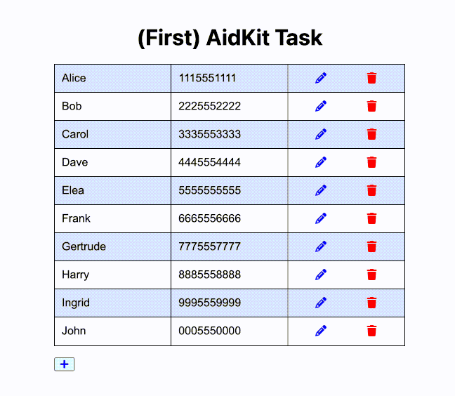
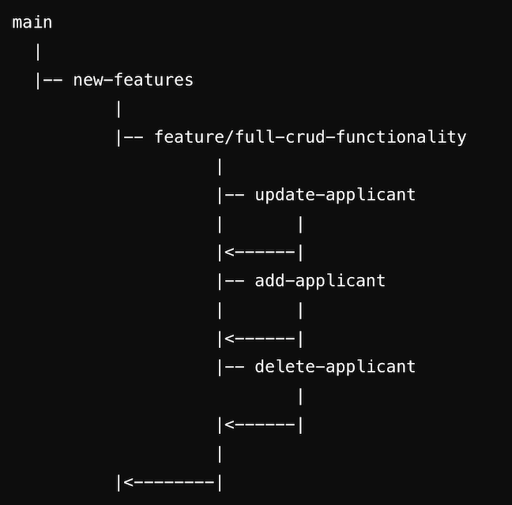

# Development Journal

The suggested starter task was a feature to add new applicants to the database. I knew I'd end up wanting to add full CRUD functionality, and tried to think ahead to ensure a clear and smooth integration between each user action. I did some research and ended up with this inline editing flow:

so I decided on a branching strategy that actually set the foundation with the ability for a user to edit an existing applicant, since adding a new applicant is actually more like editing a blank applicant.

## feature/update-applicant

### Challenges

- The most difficult challenge I faced here was the fact that the original database didn't have an ID column - or any primary key for that matter. I could have just updated `database.db` or `init.ts`, but it felt wrong to change the starting point. So I decided to simulate migrations in order to keep the original database file intact.

- Allowing the user to cancel their edit took me longer than it should have; in fact, I didn't even accomplish it in this branch. For a user to be able to update an applicant, I didn't need to pass in `applicants` or `setApplicants` as props to the component yet since I could just rely on the `Row` component's local state for an optimistic update. When I thought about canceling an edit, I got ahead of myself: I thought about refetching data, which made me think about server state, which made me think it was too much for a demo app. Fortunately, after passing those new props for creation and deletion functionality, I realized that I had the original state of the applicant in the `applicant` array that I could revert to.

### Future Considerations

- The most important fix that needs to be made app-wide is ensuring that client state and server state are synchronized. Right now I'm relying on perfectly optimistic client state, where the UI always happens to coincide with the database. I think the first step on that journey is making more fetch requests after sending updates, but even better would be a tool like TanStack Query with a cache that automatically refetches data after being invalidated.

- In the same vein, the user currently isn't given any feedback about whether their actions were actually successful or not. Ideally we'd give feedback, and revert any optimistic updates in the event of an error.

- Right now, full rows are sent in a PUT request, even if the user only changes one field. Depending on how many columns we add in the future and how large the dataset becomes, it might be worth using PATCH requests to only update edited fields.

## feature/create-applicant

### Challenges  

- Setting a placeholder applicant with an ID of 0 feels a little bit like a workaround; when the app becomes more complex with multiple concurrent operations or failed API calls, I can see conflicts arising. In fact, if I hadn't diabled the '+' button when a blank row was present, we'd probably see some of those issues now. I think the bare minimum next step would be to generate unique temporary IDs.

### Future Considerations

- It might be nice to be able to add multiple applicants at a time in the future; in fact, it might be nice to do the same with updating and deleting, perhaps all at the same time in an integrated flow or view. Switching our foundations from inline editing to editing in a modal might be worth consideration.

- I think it probably makes sense to move the '+' button inside of the `ApplicantTable` component for reusability.

## feature /delete-applicant

After working through the other features, this was actually pretty straightforward. The path for making a fetch call with an ID and optimistically updating the UI was pretty clearly laid out by this point.
